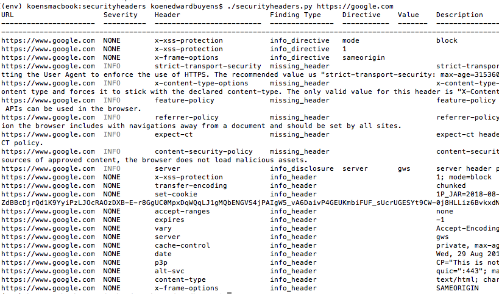
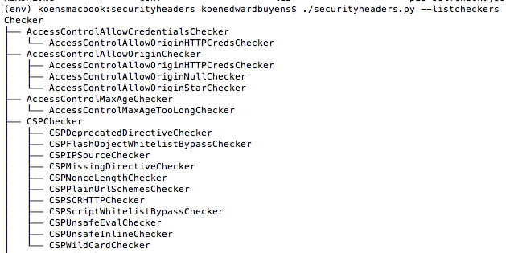
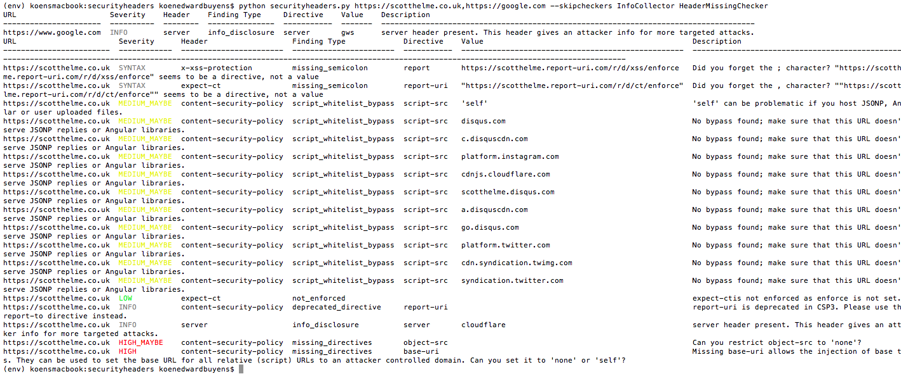
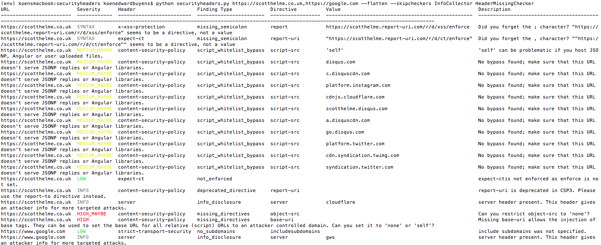
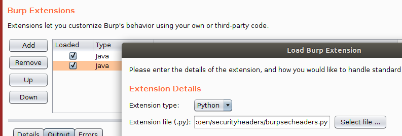
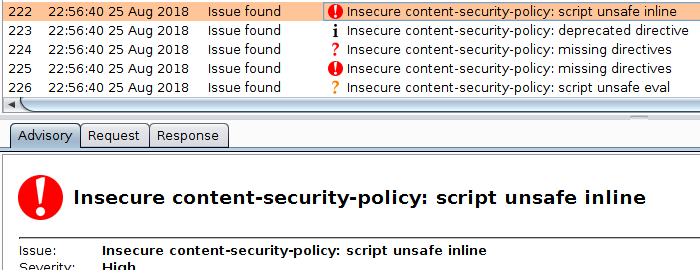
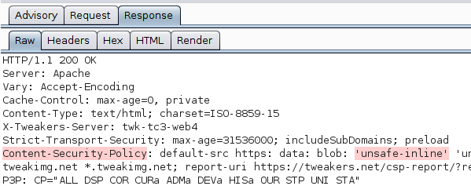

# TL; DR
The script validates whether the headers pertaining to security are present and if present, whether they have been configured securely.
It implements checks identified by
- http://securityheaders.io/
- https://csp.withgoogle.com
- OWASPs cheat sheets
- Original research


# Table of Contents
- [Introduction](#introduction)
- [Installation and Execution](#installation-and-execution)
  * [Using Docker](#using-docker)
  * [Using Burp](#using-burp)
- [Security Headers](#security-headers)
  * [Content Security Policy](#content-security-policy)
    + [Specify default-src](#specify-default-src)
    + [Specify object-src, script-src, and base-uri](#specify-object-src-script-src-and-base-uri)
    + [Avoid using unsafe-inline](#avoid-using-unsafe-inline)
    + [Avoid using unsafe-eval](#avoid-using-unsafe-eval)
    + [Avoid using the wild-card](#avoid-using-the-wild-card)
    + [Avoid specifying an IP source](#avoid-specifying-an-ip-source)
    + [Avoid using deprecated directives](#avoid-using-deprecated-directives)
    + [Avoid using sources that start with http:](#avoid-using-sources-that-start-with-http)
    + [Avoid using sources that are untrusted](#avoid-using-sources-that-are-untrusted)
  * [HTTP Strict Transport Security](#http-strict-transport-security)
    + [Include the includeSubdomains directive](#include-the-includesubdomains-directive)
    + [Avoid setting the `max-age` directive to 0](#avoid-setting-the-max-age-directive-to-0)
  * [X-Frame-Options](#x-frame-options)
    + [Avoid using allow-from](#avoid-using-allow-from)
  * [X-Content-Type-Options](#x-content-type-options)
    + [Avoid setting the header to anything other than nosniff](#avoid-setting-the-header-to-anything-other-than-nosniff)
  * [X-XSS-Protection](#x-xss-protection)
    + [Avoid disabling the filter](#avoid-disabling-the-filter)
    + [Avoid using a HTTP report URI](#avoid-using-a-http-report-uri)
    + [Use block](#use-block)
  * [Cross-Origin Resource Sharing](#cross-origin-resource-sharing)
    + [Avoid allowing access from all origins](#avoid-allowing-access-from-all-origins)
    + [Avoid using the null header with credentialed requests](#avoid-using-the-null-header-with-credentialed-requests)
    + [Only allow HTTPS origins for requests with credentials](#only-allow-https-origins-for-requests-with-credentials)
    + [Avoid setting the preflight time for longer than 30 minutes](#avoid-setting-the-preflight-time-for-longer-than-30-minutes)
    + [Avoid exposing sensitive headers](#avoid-exposing-sensitive-headers)
  * [Referrer-Policy](#referrer-policy)
    + [Avoid using unsafe-url and origin-when-cross-origin](#avoid-using-unsafe-url-and-origin-when-cross-origin)
  * [Feature-Policy](#feature-policy)
    + [Avoid using the wild-card character](#avoid-using-the-wild-card-character)
  * [Other](#other)
  * [Syntax Errors](#syntax-errors)
- [References](#references)
  * [Clear-Site-Data](#clear-site-data)
  * [Content-Security-Policy](#content-security-policy)
  * [CORS](#cors)
  * [Feature-Policy](#feature-policy-1)
  * [HPKP](#hpkp)
  * [HTTP-Strict-Transport-Security (HSTS)](#http-strict-transport-security-hsts)
  * [Referrer-Policy](#referrer-policy-1)
  * [X-Frame-Options (XFO)](#x-frame-options-xfo)
  * [X-Content-Type-Options](#x-content-type-options-1)
  * [X-Download-Options](#x-download-options)
  * [X-Permitted-Cross-Domain-Policies](#x-permitted-cross-domain-policies)
  * [X-XSS-Protection](#x-xss-protection-1)

# Introduction
Applications can set secure HTTP response headers as an additional layer of defense that prevents browsers from running into easy preventable vulnerabilities.
The script in this repository validates whether the headers pertaining to security are present and if present, whether they have been configured securely.
In summary, the script implements the checks identified by

- http://securityheaders.io/
- https://csp.withgoogle.com
- original research


# Installation and Execution
Make sure you have [Python 2](https://www.python.org/downloads/) installed.

Install the dependencies:
```bash
pip install -r requirements.txt
```

Start the script as follows.
``` bash
python securityheaders.py URI
```

Use the -h flag for all options.
``` bash
python securityheaders.py -h
```
In the example below, we execute the script to validate the headers of google.com.
``` bash
python securityheaders.py google.com
```


By default the script will display all the response headers it received from the server. To not display those, execute the `--skipheaders` flag with the `InfoCollector` value.
``` bash
python securityheaders.py google.com --skipcheckers InfoCollector
```


The script also shows if security headers are missing. To disable those checks, add `HeaderMissingChecker` to the `--skipheaders` flag.
``` bash
python securityheaders.py google.com --skipcheckers InfoCollector HeaderMissingChecker
```


The script can show a list of supported checkers via the `--listcheckers` flag.
``` bash
python securityheaders.py --listcheckers
```


By default the script executes all of the listed checkers. Disable checkers with the `--skipcheckers` flag or execute specific checkers with the `--checkers` flag. If a checker has children, then the script skips or executes all the children checkers. In the example below, the script executes all checkers that find Content Security Policy issues, but skips the checkers that fire when the CSP header is missing.
``` bash
python securityheaders.py https://scotthelme.co.uk --checkers CSPChecker --skipcheckers HeaderMissingChecker
```


By default the script shows the output in a tabular format. To create output in a different format, use the `--formatter` flag. In the example below, the script outputs the findings as CSV. Note that formatters base64-encode the fields that may contain control characters for that format. For instance, for CSV the description is base 64 encoded as it may contain commas.
``` bash
python securityheaders.py https://scotthelme.co.uk --formatter csv
```


``` bash
python securityheaders.py --listformatters
```


To write output to a file rather displaying it on the screen, use the --file flag.
``` bash
python securityheaders.py https://scotthelme.co.uk --file ./tmp
```

To check multiple websites, separate them with a comma.
``` bash
python securityheaders.py https://scotthelme.co.uk,https://google.com --skipcheckers InfoCollector HeaderMissingChecker
```


To merge output into one table, use the `--flatten` flag. Avoid this if you are checking many (500k+) websites, as you may run out of memory.
``` bash
python securityheaders.py https://scotthelme.co.uk,https://google.com --flatten --skipcheckers InfoCollector HeaderMissingChecker
```


To load URLs from a file, use a filename rather than a URL.
``` bash
python securityheaders.py top10.txt --flatten
```

If the file is a CSV file, tell the column with URLs with the `--urlcolumn` flag. To skip the CSV header row, use the `--startrow` flag.
``` bash
python securityheaders.py majestic_10.csv --startrow 2 --urlcolumn 2
```

## Using Docker

For easy portablity, we added support for Docker for the cli tool.

Build the container:
```bash
docker build -t securityheaders:latest .
```

Run the container:
```bash
docker run -it --rm securityheaders:latest {URI} [options]
```

*Note:* if you wish to add your own bypass files, use Docker `volumes`:
```bash
docker run -it --rm -v ~/whitelists:/securityheaders/conf securityheaders:latest {URI} [options]
```

## Using Burp
The checkers are also available as a BurpSuite plugin. The plugin does not display missing security headers or information about headers; i.e. it uses the `--checker Checker --skipcheckers InfoCollector HeaderMissingChecker` flags. Feel free to modify the code if you want to display those; I may or may not implement a configuration screen.

Install it as follows.
1. Go to Extender, Extensions, and click on Add Extension. Select python and load the burpecheaders.py file.


2. Once BurpSuite loads the plugin successfully, visit a website and observe that the plugin reports issues under the scanner tab.

  

Observe that the plugin highlights the offending header/directives/keywords in the response headers.


# Security Headers
This section lists background information that help you understand the issues the tool reports. The reference section at the end of this README points you to more detailed information.

Security headers are [HTTP headers](https://www.w3.org/Protocols/rfc2616/rfc2616-sec6.html#sec6.2) that enable the server to influence the behavior of the browser from a security perspective. The remainder of this section describes security headers and their common insecure configurations.

## Content Security Policy
A [Content Security Policy (CSP)](https://developer.mozilla.org/en-US/docs/Web/HTTP/Headers/Content-Security-Policy) consists of a set of directives that restrict how a webpage loads resources, such as scripts and media files. The CSP protects a web page from various attacks, such as cross-site scripting (XSS) and clickjacking.

The directives that a CSP support include the following:
- **[default-src](https://developer.mozilla.org/en-US/docs/Web/HTTP/Headers/Content-Security-Policy/default-src)**: this directive sets defaults for fetch directives (directives related to fetching of resources, such as scripts or style sheets). If none of the fetch directives have been defined in the policy, then the browser will enforce the `default-src` values. Valid values include the following ones.
  - *`<host-source>`*: Only fetch media hosted by any of the specified hosts. The hosts can be IP-addresses, names, or names with the wildcard character (`*`).
  - *`<scheme-source>`*: Only fetch media from URIs that match the specified schemas, such as `http:` or `https:`.
  - *`'none'`*: do no allow media of this type.
  - *`'self'`*: only fetch media hosted by the host sending this policy.
  - *`'unsafe-inline'`*: allow execution of inline code. An example would be code that exists in event handler or within script tags.
  - *`'unsafe-eval'`*: allow execution of code via `eval` functions, such as `eval`, `setTimeout`, `setInterval`, new Function, etc.
  - *`'<hash-algorithm>-<base64-value>'`*: allows developers to whitelist an inline script by specifying its hash as an allowed source of the script. If the hash matches, it is executed. This value is only available for CSP version 2 and above.
  - *`'nonce-<base64-value>'`:* allows developers to whitelist an inline script by sending a random nonce (generated for each request) as a potential `script-src` source. If the `script-src` has the same nonce, it is executed. This is only valid for CSP version 2 and above.
  - *`'strict-dynamic'`:* specifies that the trust given to one of the scripts with a nonce or hash is propagated to all the scripts loaded by that nonce/hash script, even if those loaded scripts do not match `self` or a whitelist.
- **[script-src](https://developer.mozilla.org/en-US/docs/Web/HTTP/Headers/Content-Security-Policy/script-src)**: this directive determines valid sources of JavaScript.
- **[object-src](https://developer.mozilla.org/en-US/docs/Web/HTTP/Headers/Content-Security-Policy/object-src)**: this directive determines where plugins can be loaded and executed from.
- **[style-src](https://developer.mozilla.org/en-US/docs/Web/HTTP/Headers/Content-Security-Policy/style-src)**: this directive determines where CSS or style markup can be loaded from. This also supports nonces and hash values.
- **[img-src](https://developer.mozilla.org/en-US/docs/Web/HTTP/Headers/Content-Security-Policy/img-src)**: this directive determines where images can be loaded from.
- **[media-src](https://developer.mozilla.org/en-US/docs/Web/HTTP/Headers/Content-Security-Policy/media-src)**: this directive defines valid sources of audio and video, e.g. HTML5 <audio>.
- **[frame-src](https://developer.mozilla.org/en-US/docs/Web/HTTP/Headers/Content-Security-Policy/frame-src)**: this directive defines valid sources for loading frames.
- **[font-src](https://developer.mozilla.org/en-US/docs/Web/HTTP/Headers/Content-Security-Policy/font-src)**: this directive defines valid sources of fonts.
- **[connect-src](https://developer.mozilla.org/en-US/docs/Web/HTTP/Headers/Content-Security-Policy/connect-src)**: this directive determines whether the web application can perform connections via XMLHttpRequest, WebSocket, or EventSource.
- **[sandbox](https://developer.mozilla.org/en-US/docs/Web/HTTP/Headers/Content-Security-Policy/sandbox)**: this directive specifies a sandbox policy for ‘safely’ embedding content into a sandbox.
- **[report-uri](https://developer.mozilla.org/en-US/docs/Web/HTTP/Headers/Content-Security-Policy/report-uri)**: this directive instructs the browser to post a report of policy failures to this URI. Deprecated in CSP version 3.
- **[report-to](https://developer.mozilla.org/en-US/docs/Web/HTTP/Headers/Content-Security-Policy/report-to)**: This directive is the successor of report-uri (CSP Version 3).
- **[base-uri](https://developer.mozilla.org/en-US/docs/Web/HTTP/Headers/Content-Security-Policy/base-uri)**: this directive restricts the URLs that can be used to specify the document [base URL](https://developer.mozilla.org/en-US/docs/Web/HTML/Element/base). This URL determines the base for all relative URLs contained within a HTML document.  Only from CSP version 2 and above.
- **[child-src](https://developer.mozilla.org/en-US/docs/Web/HTTP/Headers/Content-Security-Policy/child-src)**: this directive defines valid sources for web workers and nested browsing contexts loaded using elements such as <frame> and <iframe>. Only in CSP version 2. Deprecated in version 3.
- **[form-action](https://developer.mozilla.org/en-US/docs/Web/HTTP/Headers/Content-Security-Policy/form-action)**: this directive defines valid URLs that can be used as HTML <form> action. Only from CSP version 2 and above.
- **[frame-ancestors](https://developer.mozilla.org/en-US/docs/Web/HTTP/Headers/Content-Security-Policy/frame-ancestors)**: this directive determines the sources from where the resource can be framed. Only from CSP version 2 and above.
- **[plugin-types](https://developer.mozilla.org/en-US/docs/Web/HTTP/Headers/Content-Security-Policy/plugin-types)**: this directive defines valid MIME types for plugins invoked via <object> and <embed>.  Only CSP version 2 and above.
- **[worker-src](https://developer.mozilla.org/en-US/docs/Web/HTTP/Headers/Content-Security-Policy/worker-src)**: this directive restricts the URLs which may be loaded as a Worker, SharedWorker, or ServiceWorker. Only CSP version 3 and above.
- **[manifest-src](https://developer.mozilla.org/en-US/docs/Web/HTTP/Headers/Content-Security-Policy/manifest-src)**: this directive restricts the URLs from which the application's manifest may be loaded. Only CSP version 3 and above.


The tool validates the following best practices for CSPs (`CSPChecker`).

### Specify default-src
Always include the `default-src` directive as the CSP allows loading a resource if there is not a specific directive and `default-src` was not specified as a fall back mechanism.

The tool will thus flag the following policy as insecure (`CSPMissingDirectiveChecker`).
``` http
Content-Security-Policy: img-src 'none';
```
The policy does not specify `default-src` and thus allows loading of scripts of questionable origins.

### Specify object-src, script-src, and base-uri
Explicitly specify `object-src`, `script-src`, and `base-uri`, as without those directives and a restrictive `default-src` directive, execution of malicious JavaScript is still possible:
- no `object-src` allows the injection of plugins that can execute JavaScript.
- no `script-src` allows attackers to execute scripts if an attacker is able to execute a XSS attack.
- no `base-uri` allows attackers to steal information by changing what domain all relative URLs use via injecting a base tag into the head of a page.

The tool will thus flag the following policy as insecure (`CSPMissingDirectiveChecker`).
```http
Content-Security-Policy: img-src 'none';
```

### Avoid using unsafe-inline
Using `'unsafe-inline'` allows execution of third-party JavaScript inline. It is better to use hashes or nonces for the inline scripts.

The tool will thus flag the following policy as insecure (`CSPUnsafeInlineChecker`).
```http
Content-Security-Policy: script-src 'unsafe-inline';
```

### Avoid using unsafe-eval
Using `'unsafe-eval'` allows execution of untrusted JavaScript at runtime with eval.

The tool will thus flag the following policy as insecure (`CSPUnsafeEvalChecker`).
```http
Content-Security-Policy: script-src 'unsafe-eval';
```

### Avoid using the wild-card
 Avoid setting `object-src` to the wildcard character `*`, as it allows loading of arbitrary plugins that can execute JavaScript (e.g. Flash).

The tool will thus flag the following policy as insecure (`CSPWildCardChecker`).
```http
Content-Security-Policy: object-src '*';
```

### Avoid specifying an IP source
[Avoid using localhost](https://developer.chrome.com/extensions/contentSecurityPolicy) as a source as it allows accessing a server with resources running on localhost. For production environments, it is recommended to remove this.

The tool will thus flag the following policy as insecure (`CSPIPSourceChecker`).
```http
Content-Security-Policy: script-src https://127.0.0.1;
```

### Avoid using deprecated directives
Avoid using deprecated directives. For instance, report-uri is deprecated in CSP3.

The tool will thus flag the following policy as insecure (`CSPDeprecatedDirectiveChecker`).
```http
Content-Security-Policy: report-uri https://report-uri.com/report
```

### Avoid using sources that start with http:
Avoid allowing resources to be loaded over HTTP, as an attacker may be able to modify those resources via e.g. a Man-in-the-middle attack. The impact depends on the type of resource.

The tool will thus flag the following policy as insecure (`CSPPlainUrlSchemesChecker` and `CSPSCRHTTPChecker`).
```http
Content-Security-Policy: script-src http:;
```

### Avoid using sources that are untrusted
Fetch directives define from where content may be loaded. These directives should be set to 'self', 'none' or a whitelist of trusted domains to prevent injection of third-party content. If the whitelist of trusted domains contains compromised hosts, then malicious media may be loaded into the application.

The tool validates whether the policy allows loading of resources from known untrusted/compromised hosts. The list of known untrusted domains is taken from https://github.com/google/csp-evaluator/tree/master/whitelist_bypasses .

The tool will thus flag the following policy as insecure as gstatic is know to host Angular libraries that can bypass this CSP (`CSPFlashObjectWhitelistBypassChecker` and `CSPScriptWhitelistBypassChecker`).
```http
Content-Security-Policy: default-src 'none'; script-src https://gstatic.com
```

## HTTP Strict Transport Security
The HTTP Strict Transport Security (HSTS) header ensures that all communication (to a website) is being protected via SSL/TLS. If the browser encounters this header, it will use HTTPS for all subsequent communications with that server.

The header has the following directives:
- **max-age**: specifies the number of seconds the browser regards the host as a known HSTS Host.  
- **includeSubdomains**: this optional directive indicates that the HSTS Policy applies to this HSTS Host as well as any subdomains of
   the host's domain name.
- **preload**: the `preload` directive indicates that the domain can be preloaded in the browser as a known HSTS host.

An example policy as as follows:
```http
 Strict-Transport-Security: max-age=31536000; includeSubDomains; preload
```

The tool performs the following checks (`HSTSChecker`).

### Include the includeSubdomains directive
From OWASP:
> Cookies can be manipulated from sub-domains, so omitting the `includeSubDomains` option permits a broad range of cookie-related attacks that HSTS would otherwise prevent by requiring a valid certificate for a subdomain. Ensuring the "Secure Flag" is set on all cookies will also prevent, some, but not all, of the same attacks.

The tool will thus flag the following HSTS header as insecure as the `includeSubDomains` option is not set (`HSTSSubdomainsChecker`).
```http
 Strict-Transport-Security: max-age=31536000
```

### Avoid setting the `max-age` directive to 0
The browser will no longer regard the host as an HSTS host and therefore the HSTS header is not enforced.

The tool will flag the following as insecure (`HSTSMaxAgeZeroChecker`).
```http
 Strict-Transport-Security: max-age=0; includeSubDomains; preload
```

## X-Frame-Options
The [`X-Frame-Options` HTTP header](https://developer.mozilla.org/en-US/docs/Web/HTTP/Headers/X-Frame-Options) mitigates click-jacking attacks by limiting what can be rendered in a frame. The header can specify one of the following options:
- `DENY`: do not render the page if it is in an iframe.
- `SAMEORIGIN`: do not render the page if it is in an iframe on any page hosted outside the framed page's domain.
- `ALLOW-FROM`: only allow a specific origin in which this page be framed.

The tool validates the following (`XFrameOptionsChecker`).

### Avoid using allow-from
Allow-from allows rendering from other domains. Note that this might be OK and thus need to be manually verified.

The tool will thus flag the following as insecure (`XFrameOptionsNotAllowFromChecker`).
```http
 X-Frame-Options: ALLOW-FROM https://example.com/
```

## X-Content-Type-Options
The [X-Content-Type-Options header](https://developer.mozilla.org/en-US/docs/Web/HTTP/Headers/X-Content-Type-Options) stops a browser from trying to MIME-sniff the content type and forces it to stick with the declared content-type.

The tool performs the following checks (`XContentTypeOptionsChecker`).

### Avoid setting the header to anything other than nosniff
Setting the value to nosniff blocks MIME-sniffing (i.e. guessing the content-type based on the contents) for script and style types and thus prevents transforming non-executable MIME types into executable MIME types.

The tool will NOT flag the following header (`XContentTypeOptionsNoSniffChecker`).

```http
X-Content-Type-Options: nosniff
```

## X-XSS-Protection
The [X-XSS-Protection header](https://developer.mozilla.org/en-US/docs/Web/HTTP/Headers/X-XSS-Protection) sets the configuration for the cross-site scripting filter built into most browsers. If it is enabled, the browser will stop pages from loading when it detects reflected cross-site scripting (XSS) attacks.

The value can be any of the following:
- **`0`**: disable the filter.
- **`1`**: enable the filter.
- **`1; mode=block`**: enable the filter, but prevent the page from rendering rather than sanitizing it when an attack is detected.
- **`1; report=uri`**: enable the filter, sanitize it, and send the violation to the given URI.

The tool validates the following (`XXSSProtectionChecker`).
### Avoid disabling the filter
The tool detects whether the filter has been disabled.
```http
X-XSS-Protection: 0
```
### Avoid using a HTTP report URI
The tool detects whether reports are send to a HTTP endpoint. The tool flags the following as insecure (`XXSSProtectionHTTPSReportChecker`).
```http
 X-XSS-Protection: 1; report=http://example.com/report
```
### Use block
Blocking the attack is preferred (`XXSSProtectionBlockChecker`). The tool will thus report the following as an informational error.
```http
 X-XSS-Protection: 1
```

## Cross-Origin Resource Sharing
A Cross-Origin Resource Sharing (CORS) policy controls whether and how content running on other origins can interact with the origin that publishes the policy.

The policy is defined by multiple headers:
- **`Access-Control-Allow-Origin`**: a list of one or more URIs that may access the resource.
- **`Access-Control-Allow-Methods`**: specifies the HTTP method or methods that are allowed to access the resource.
- **`Access-Control-Allow-Headers`**: indicates which HTTP headers can be used when making the actual request to access the resource.
- **`Access-Control-Allow-Credentials`**: indicates whether or not the response to the request can be exposed when the credentials flag is true.
- **`Access-Control-Expose-Headers`**: a whitelist of headers that the browser can access.
- **`Access-Control-Max-Age`**: indicates how long the results of preflight requests can be cached.

The tool performs the following checks.

### Avoid allowing access from all origins
Allowing access from all origins (`*`) allows the requested resource to be shared with any origin; i.e. the standard same origin policy enforced by the browser is discarded. The tool will thus report the following as insecure (`AccessControlAllowOriginStarChecker`).
```http
Access-Control-Allow-Origin: *
```

### Avoid using the null header with credentialed requests
Allowing the null origin for requests with credentials enables an attacker to hijack the victim's session (redirects and local files have a null origin).
The tool will thus report the following as insecure (`AccessControlAllowOriginNullChecker`).
```http
Access-Control-Allow-Origin: null
Access-Control-Allow-Credentials: true
```

### Only allow HTTPS origins for requests with credentials
Allowing non-HTTPS origins in a CORS policy enables an attacker who is able to perform a man-in-the-middle (MiTM) between the victim and the trusted partner to inject malicious code which can be used to attack the server sending the policy.
The tool will thus report the following as insecure (`AccessControlAllowOriginHTTPCredsChecker`).
```http
Access-Control-Allow-Origin: http://google.com, https://facebook.com, http://synopsys.com
Access-Control-Allow-Credentials: true
```

### Avoid setting the preflight time for longer than 30 minutes
The Access-Control-Max-Age header instructs the browser to cache responses to preflight requests. The time is how long the browser can cache the request.
If this is too long, a browser may use outdated information.
The tool will thus report the following as insecure (`AccessControlMaxAgeTooLongChecker`).
```http
Access-Control-Max-Age: 20000
```

### Avoid exposing sensitive headers
TODO

(e.g. do not expose auth headers)


## Referrer-Policy
The [Referer HTTP header](https://developer.mozilla.org/en-US/docs/Web/HTTP/Headers/Referer) is set by browsers to tell the server the page that brought it there. The [Referrer-Policy header](https://developer.mozilla.org/en-US/docs/Web/HTTP/Headers/Referrer-Policy) specifies whether the browser is allowed to send the Referer header.

The Referrer-Policy supports the following directives:
- **no-referrer** ensures that the browser does not send referrer information with requests.
- **no-referrer-when-downgrade**: the browser does not send the URL as referrer when the protocol security level changes to a less secure destination (HTTPS→HTTP).
- **origin**: the browser always sends the origin of the document as referrer. For instance, the document https://example.com/page.html will send the referrer https://example.com/.
- **origin-when-cross-origin**: The browser sends the full URL when performing a same-origin request, but only sends the origin of the document for other cases.
- **same-origin**: The browser sends the referrer for same-site origins, but will not send the referrer for cross-origin requests.
- **strict-origin**: The browser sends the origin of the document as the referrer when the protocol security level stays the same (HTTPS→HTTPS), but does not send it to a less secure destination (HTTPS→HTTP).
- **strict-origin-when-cross-origin**: The browser sends the full URL when performing a same-origin request, but only sends the origin when the protocol security level stays the same (HTTPS→HTTPS), and sends no header to a less secure destination.
- **unsafe-url**: The browser sends the full URL when performing a same-origin or cross-origin request.

The tool identifies the following issues (`ReferrerPolicyChecker`).

### Avoid using unsafe-url and origin-when-cross-origin
These values allow transfer of sensitive information (via the Referer header) from HTTPS environments to HTTP environments.

The tool flags the following as insecure (`ReferrerPolicyInsecureChecker`).
```http
 Referrer-Policy: unsafe-url
```

## Feature-Policy
The [Feature-Policy header](https://wicg.github.io/feature-policy/) allows a site to control which features and APIs can be used in the browser (location services, etc.).

This policy is still under development: each browser can implement the directives it desires. The directives supported by Google Chrome are listed below.
- **[accelerometer](https://w3c.github.io/sensors/#feature-policy-api)**: selectively control whether or not the accelerometer can be used in a document.
- **[ambient-light-sensor](https://w3c.github.io/sensors/#feature-policy-api)**: selectively control whether or not the sensor can be used in a document.
- **camera**: selectively control access to video input devices.
- **encrypted-media**: selectively control whether usage of `requestMediaKeySystemAccess()` is allowed.
- **autoplay**: selectively enable and disable use of autoplay.
- **fullscreen**: selectively enable and disable use of fullscreen; i.e. access to `requestFullscreen()`.
- **[lazyload](https://github.com/WICG/feature-policy/issues/193)**: selectively control the lazyload attribute on <iframe> and  tags.
- **[geolocation](https://w3c.github.io/sensors/#feature-policy-api)**: selectively control whether or not the sensor can be used in a document.
- **[gyroscope](https://w3c.github.io/sensors/#feature-policy-api)**: selectively control whether or not the sensor can be used in a document.
- **[magnetometer](https://w3c.github.io/sensors/#feature-policy-api)**: selectively control whether or not the sensor can be used in a document.
- **microphone**: selectively control access to audio input devices.
- **midi**: selectively control access to the `requestMIDIAccess()` method.
- **payment**: selectively control acccess to the `PaymentRequest` interface.
- **speaker**: selectively control access to audio output devices.
- **[sync-xhr](https://xhr.spec.whatwg.org/#feature-policy-integration)**: selectively control whether resources can be fetched.
- **[sync-script](https://github.com/WICG/feature-policy/issues/135)**: selectively control whether scripts are executed.
- **usb**: selectively control access to USB devices.
- **vr**: selectively control access to VR displays.
- **picture-in-picture**: selectively control access to Picture in Picture.
- **[document-write](https://github.com/WICG/feature-policy/blob/master/policies/document-write.md)**: selectively control the usage of document stream processing APIs (`document.write`).
- **[image-compression](https://github.com/loonybear/feature-policy/blob/images/policies/optimized-images.md#image-compression)**: selectively enable/disable restrictions on images to have a file size (in terms of number of bytes) no more than X times bigger than the image size (width * height).
- **[legacy-image-formats](https://github.com/loonybear/feature-policy/blob/images/policies/optimized-images.md#legacy-image-formats)**: selectively enable/disable restrictions on images to be one of certain modern formats.
- **[max-downscaling-image](https://github.com/loonybear/feature-policy/blob/images/policies/optimized-images.md#maximum-downscaling-image)**: selectively enable/disable restrictions on images to be no more than X times bigger than the container size.
- **[unsized-media](https://github.com/WICG/feature-policy/blob/master/policies/unsized-media.md)**: selectively control whether a default size will be chosen for images if they do not specify one before rendering.
- **vertical-scroll**:
- **[animations](https://github.com/WICG/feature-policy/blob/master/policies/animations.md)**: selectively control the set of CSS properties which can be animated.

The values for each of these features can be:
- `<source>`:
- `*`: *The feature is allowed in documents in top-level browsing contexts by default, and when allowed, is allowed by default to documents in nested browsing contexts.*
- `'none'`: *The feature is disallowed in documents in top-level browsing contexts by default, and is also disallowed by default to documents in nested browsing contexts.*
- `'self'`: *The feature is allowed in documents in top-level browsing contexts by default, and when allowed, is allowed by default to same-origin domain documents in nested browsing contexts, but is disallowed by default in cross-origin documents in nested browsing contexts.*

The tool identifies the following issues (`FeaturePolicyChecker`).


### Avoid using the wild-card character
The wild-card character allows any embedee to access the feature in the given browsing context. The tool flags thus the following as insecure (`FeaturePolicyWildCardChecker`).
```http
camera *; microphone *
```


## Other
- **Information Disclosure** (`InfoDisclosureChecker`): The tool also checks the presence of headers that disclose information about the application or tech stack.
Such information enables the attacker to perform more targeted attacks. The tool flags thus any of the following as insecure.
``` http
Server: Apache/2.4.1 (Unix)
X-Powered-By: ZendServer 8.5.0,ASP.NET
```
- **Deprecated Headers** (`HeaderDeprecatedChecker`): The Content-Security-Policy headers `X-Content-Security-Policy`, `X-WebKit-CSP`, and `Public-Key-Pins` are outdated and should not be used.


## Syntax Errors
The tool also identifies the following syntactical errors (`SyntaxChecker`) for all headers.
- **Empty Header** (`HeaderEmptyChecker`): using the header with an empty value is equivalent to no header. The tool will thus flag the following policy as an error.
```http
Content-Security-Policy:
```
- **Unknown directives** (`UnknownDirectiveChecker`): unknown directives (e.g. due to typos) are ignored by the browser.
The tool will thus mark the following as an error.
```http
Content-Security-Policy: scipt-src 'unsafe-eval';
```
- **Missing separator characters** (`MissingSeparatorChecker`): directives are separated with a separator character. If a directive keyword is part of another, one can assume that the separator character is missing. The tool will thus mark the following as an error.
```http
Content-Security-Policy: script-src 'unsafe-eval' object-src
```
- **Missing Directive** (`MissingDirectiveChecker`): using a header without a required directive is an issue. The tool will thus mark the following as an error as max-age is missing.
```http
Expect-CT: enforce
```
- **Empty Directives** (``): using a directive without a required value is an issue. The tool will thus mark the following as an error.
```http
x-frame-options:allow-from
```

# References
The following pages were helpful in understanding the different security headers.
## Clear-Site-Data
- [Spec](https://w3c.github.io/webappsec-clear-site-data/)

## Content-Security-Policy
- [Introduction by Github Engineering](https://githubengineering.com/githubs-csp-journey/)
- [Spec](https://w3c.github.io/webappsec-csp/)
- [OWASP Cheat Sheet](https://www.owasp.org/index.php/Content_Security_Policy_Cheat_Sheet)

## CORS
- [Introduction](https://developer.mozilla.org/en-US/docs/Web/HTTP/CORS)
- [Spec](https://fetch.spec.whatwg.org/)

## Feature-Policy
- [Introduction by Google](https://developers.google.com/web/updates/2018/06/feature-policy)
- [Explainer](https://docs.google.com/document/d/1k0Ua-ZWlM_PsFCFdLMa8kaVTo32PeNZ4G7FFHqpFx4E/edit)
- [Spec](https://wicg.github.io/feature-policy/)
- [Spec 2](https://github.com/WICG/feature-policy/blob/master/features.md)

## HPKP
- [Deprecated](https://groups.google.com/a/chromium.org/forum/#!msg/blink-dev/he9tr7p3rZ8/eNMwKPmUBAAJ)

## HTTP-Strict-Transport-Security (HSTS)
- [Intro](https://scotthelme.co.uk/hsts-the-missing-link-in-tls/)
- [Spec](http://tools.ietf.org/html/rfc6797)
- [OWASP Cheat Sheet](https://www.owasp.org/index.php/HTTP_Strict_Transport_Security_Cheat_Sheet)

## Referrer-Policy
- [Intro](https://scotthelme.co.uk/a-new-security-header-referrer-policy/)
- [Spec](https://www.w3.org/TR/referrer-policy/)

## X-Frame-Options (XFO)
- [Spec](https://tools.ietf.org/html/rfc7034)

## X-Content-Type-Options
- [Spec](https://docs.microsoft.com/en-us/previous-versions/windows/internet-explorer/ie-developer/compatibility/gg622941(v=vs.85))

## X-Download-Options
- [Spec](https://docs.microsoft.com/en-us/previous-versions/windows/internet-explorer/ie-developer/compatibility/jj542450(v=vs.85))

## X-Permitted-Cross-Domain-Policies
- [Spec](https://www.adobe.com/devnet/adobe-media-server/articles/cross-domain-xml-for-streaming.html)

## X-XSS-Protection
- [Spec](https://docs.microsoft.com/en-us/previous-versions/windows/internet-explorer/ie-developer/compatibility/dd565647(v=vs.85))


# TODOs
- TODOs in the above README including References
- Checkers for Set-Cookie, Cache-Control
- Decent analysis of what is a good feature policy
- Checkers for Content-Security-Policy-Report-Only (inherit from CSP, but lower severity to informational).
- Configurable ratings
- Good descriptions, including references to CWE, OWASP cheat sheets and secure headers project.
- Refactor: the horrible FindingType enum
